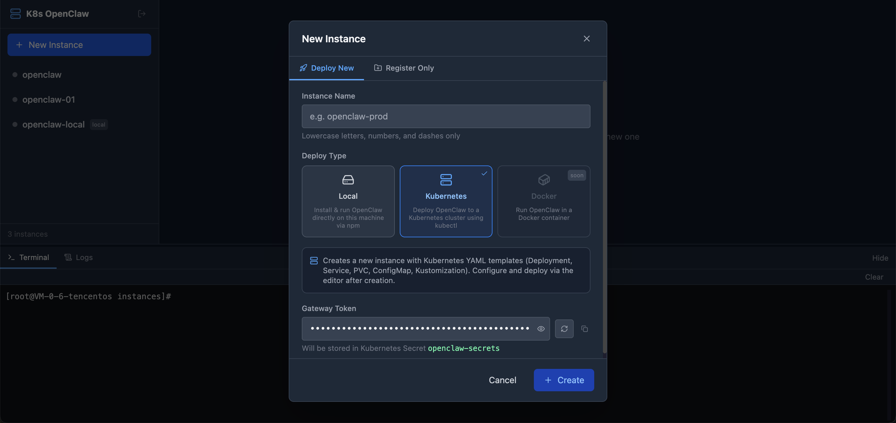
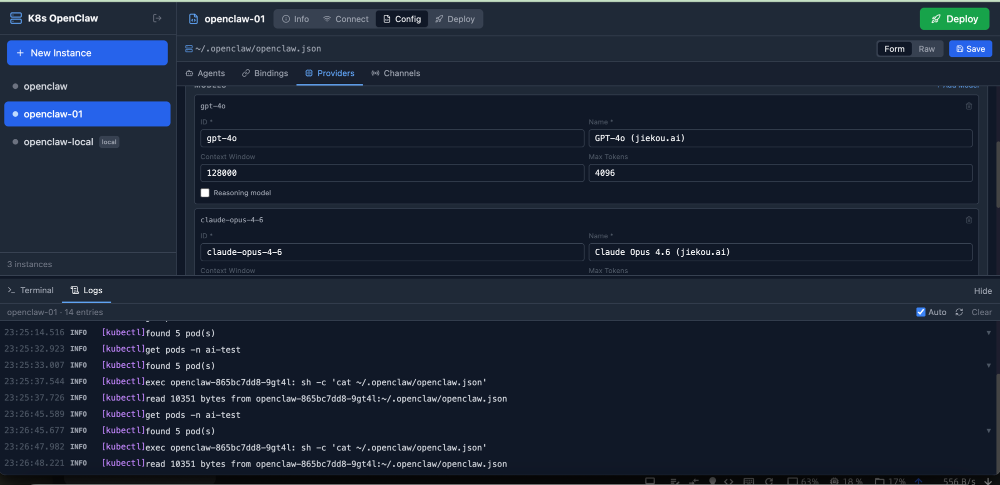
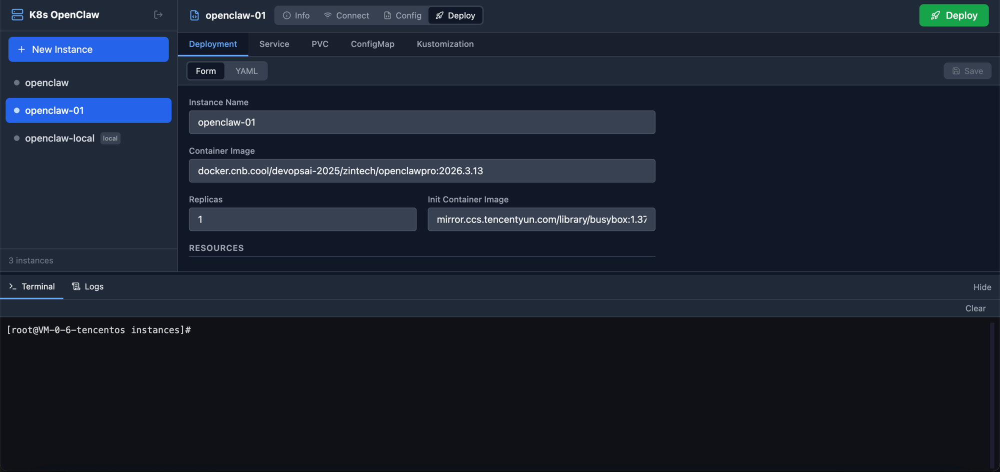

# K8s OpenClaw Manager

一个用于管理多个 [OpenClaw](https://openclaw.ai) 实例的可视化 Web 管理平台，支持 Kubernetes 部署、本地安装与实例注册，提供配置编辑、实时部署监控、Web 终端等功能。

---

## 界面预览

### 新建实例



支持 Local / Kubernetes / Docker 三种部署类型，可自定义或自动生成 Gateway Token。

### Config 编辑器 + 实时日志



可视化编辑 `openclaw.json`（Agents / Bindings / Providers / Channels），底部日志面板实时输出 kubectl 操作记录。

### Deploy 编辑器



Form / YAML 双模式编辑 Kubernetes 配置文件，支持 Deployment、Service、PVC、ConfigMap、Kustomization，一键部署。

---

## 功能概览

### 实例管理

- **Deploy New**：创建并部署新实例
  - **Local**：执行 `npm install -g openclaw@latest`，SSE 实时流式展示安装日志，完成后提示后续手动操作步骤
  - **Kubernetes**：自动生成 YAML 模板（Deployment、Service、PVC、ConfigMap、Secret、Kustomization），可自定义或自动生成 64 位 hex Gateway Token
  - **Docker**：即将支持（Coming soon）
- **Register Only**：仅创建实例目录与元数据，不执行任何安装或部署，用于接管已有实例
- **删除实例**：侧边栏悬停显示删除按钮，二次确认防误操作

### 实例详情（四个 Tab）

| Tab | 说明 |
|-----|------|
| **Info** | 实例名称、部署类型、创建时间、Gateway Token（默认遮盖，点击眼睛图标显示） |
| **Connect** | 配置 WebSocket 地址与 Token 并连接 OpenClaw Gateway；连接后可查看 Agents、Channels、Models；设备首次接入时引导设备配对流程 |
| **Config** | 可视化编辑 `openclaw.json`（Form / Raw JSON 双模式）；Local 实例自动读取 `~/.openclaw/openclaw.json`，Kubernetes 实例通过 Pod 选择器读取 |
| **Deploy** | Kubernetes：Form / YAML 双模式编辑配置文件并一键部署；Local：展示本地部署说明 |

### Config 编辑器

根据 `deployType` 自动确定数据来源，无需手动切换：

| 部署类型 | Config 来源 |
|----------|-------------|
| `local` | 自动读取 `~/.openclaw/openclaw.json` |
| `kubernetes` | Kubernetes Pod 选择器（Namespace → Pod → Container → 文件路径） |

Form 模式支持四个子 Tab：

- **Agents**：ID、名称、工作区、模型配置
- **Bindings**：Agent ↔ Channel 绑定关系
- **Providers**：API 提供商（baseUrl、apiKey）及模型列表（ID、名称、Context Window、Max Tokens、是否为推理模型）
- **Channels**：21 种 Channel 类型，字段根据类型智能渲染（boolean / select / password / array）

所有删除操作均有二次确认（点击垃圾桶 → 确认 ✓ / 取消 ✗，3 秒后自动取消）。

### Kubernetes 部署流程

1. 在 **Deploy** Tab 编辑配置文件，点击右上角绿色 **Deploy** 按钮
2. 弹出进度窗口，实时显示两个阶段：
   - ✓ Apply Kubernetes manifests（`kubectl apply -k`）
   - ✓ Wait for pod to be ready（轮询 Pod 状态，最长等待 2 分钟）
3. 完整 kubectl 日志同步显示在底部 **Logs** 面板
4. 部署成功后弹出提示，点击跳转 Connect Tab 并预填 Gateway Token

### 底部面板

- **Terminal**：集成 xterm.js PTY 终端，支持拖拽调整高度，可直接执行 Shell 命令与 `kubectl` 命令
- **Logs**：平时展示 OpenClaw Gateway 实时日志（结构化，支持展开详情）；部署期间自动切换为 kubectl 输出流

### 鉴权

- 启动时读取 `config.json` 或环境变量 `AUTH_TOKEN` 作为鉴权 Token
- 所有 `/api/*` 接口均受 Bearer Token 保护
- 前端 Token 存储于 `localStorage`，提供登录页与退出功能

---

## 技术栈

**前端**

- React 18 + TypeScript
- Vite + Tailwind CSS
- Monaco Editor（JSON / YAML 编辑器）
- xterm.js + FitAddon + WebLinksAddon（终端）
- lucide-react（图标）

**后端**

- Node.js + Express + TypeScript
- node-pty（PTY 终端）
- WebSocket（ws）
- SSE（Server-Sent Events，部署日志流、安装日志流）

---

## 目录结构

```
k8s_openclaw/
├── client/                  # React 前端（Vite）
│   └── src/
│       ├── components/
│       │   ├── CreateInstanceModal.tsx   # 新建/注册实例弹窗
│       │   ├── InstanceEditor.tsx        # 实例详情（Info/Connect/Config/Deploy）
│       │   ├── OpenClawPanel.tsx         # Connect 面板（连接管理 + Agents/Channels/Models）
│       │   ├── OcFileConfigPanel.tsx     # Config 编辑器（Form + Raw JSON）
│       │   ├── Sidebar.tsx               # 实例列表侧边栏
│       │   ├── TerminalPanel.tsx         # 底部 PTY 终端
│       │   ├── LogsPanel.tsx             # 底部日志面板
│       │   ├── LoginPage.tsx             # 登录页
│       │   └── ...                       # DeploymentForm / ServiceForm / PvcForm 等子组件
│       ├── types.ts
│       └── utils/auth.ts
├── server/                  # Express 后端
│   └── src/
│       ├── index.ts                      # 全部 API 路由与 WebSocket 终端
│       └── openclaw-client.ts            # OpenClaw WebSocket 客户端（Ed25519 鉴权）
├── templates/               # Kubernetes YAML 模板（新建 k8s 实例时复制并替换变量）
│   ├── deployment.yaml
│   ├── service.yaml
│   ├── pvc.yaml
│   ├── configmap.yaml
│   ├── secret.yaml          # 含 OPENCLAW_GATEWAY_TOKEN 占位符
│   └── kustomization.yaml
├── instances/               # 运行时数据：每个实例一个子目录
│   └── <instance-name>/
│       ├── instance.json    # 元数据（name, deployType, gatewayToken, createdAt）
│       ├── deployment.yaml
│       └── ...
├── docs/                    # 文档截图
└── package.json             # monorepo 根配置
```

---

## 快速开始

### 前置依赖

- Node.js >= 18
- npm >= 9
- kubectl（Kubernetes 部署功能需要）

### 安装

```bash
git clone <repo-url>
cd k8s_openclaw
npm install
```

### 开发模式

```bash
npm run dev
```

- 前端：http://localhost:3001

### 生产构建

```bash
npm run build
cd server && npm start
```

---

## 配置说明

### 鉴权 Token

启动前设置鉴权 Token（二选一）：

```bash
# 方式一：环境变量
AUTH_TOKEN=your-secret-token npm start

# 方式二：config.json（项目根目录）
{
  "authToken": "your-secret-token"
}
```

### instance.json

每个实例目录下自动生成，记录实例元数据：

```json
{
  "name": "my-instance",
  "deployType": "kubernetes",
  "createdAt": "2025-01-01T00:00:00.000Z",
  "gatewayToken": "64位十六进制字符串"
}
```

### Gateway Token（Kubernetes）

- 创建实例时可手动填写或点击刷新按钮自动生成（`crypto.getRandomValues` 生成 64 位 hex）
- 注入到 `secret.yaml` 的 `OPENCLAW_GATEWAY_TOKEN` 字段，以 `secretKeyRef` 方式挂载为 Pod 环境变量
- **注意**：`secret.yaml` 包含明文 Token，请勿提交到版本控制

---

## API 参考

### 实例

| 方法 | 路径 | 说明 |
|------|------|------|
| `GET` | `/api/instances` | 获取所有实例列表 |
| `POST` | `/api/instances` | 创建实例；`registerOnly: true` 仅创建目录 |
| `DELETE` | `/api/instances/:name` | 删除实例目录 |

### YAML 文件

| 方法 | 路径 | 说明 |
|------|------|------|
| `GET` | `/api/instances/:name/files/:filename` | 读取 YAML 文件 |
| `PUT` | `/api/instances/:name/files/:filename` | 保存 YAML 文件 |

### 部署

| 方法 | 路径 | 说明 |
|------|------|------|
| `POST` | `/api/instances/:name/deploy` | 执行部署（SSE：`log` / `pod_status` / `done`） |
| `GET` | `/api/instances/:name/deploy-logs` | 获取最近一次部署的完整日志 |
| `POST` | `/api/instances/:name/local-install` | 本地安装 openclaw（SSE：`log` / `done`） |

### Config 文件

| 方法 | 路径 | 说明 |
|------|------|------|
| `GET` | `/api/instances/:name/oc-config/source` | 读取 Config 来源配置 |
| `PUT` | `/api/instances/:name/oc-config/source` | 更新 Config 来源配置 |
| `GET` | `/api/instances/:name/oc-config/pods` | 获取 Kubernetes Pod 列表 |
| `GET` | `/api/instances/:name/oc-config/file` | 读取 openclaw.json |
| `PUT` | `/api/instances/:name/oc-config/file` | 保存 openclaw.json |

### OpenClaw 连接

| 方法 | 路径 | 说明 |
|------|------|------|
| `GET/PUT` | `/api/instances/:name/openclaw/settings` | 读写 Gateway URL 和 Token |
| `POST` | `/api/instances/:name/openclaw/connect` | 连接 Gateway（返回 `pairingRequired` 时需设备配对） |
| `POST` | `/api/instances/:name/openclaw/disconnect` | 断开连接 |
| `GET` | `/api/instances/:name/openclaw/status` | 连接状态（disconnected / connecting / connected / error） |
| `GET` | `/api/instances/:name/openclaw/logs` | Gateway 日志（最近 300 条） |
| `GET` | `/api/instances/:name/openclaw/agents` | Agent 列表 |
| `GET` | `/api/instances/:name/openclaw/channels` | Channel 及账号状态 |
| `GET` | `/api/instances/:name/openclaw/models` | Model 列表 |

### 终端

| 协议 | 路径 | 说明 |
|------|------|------|
| WebSocket | `/ws/terminal` | PTY 终端连接（xterm.js） |

---

## 安全警告

> **本工具具有高权限操作能力，请务必做好网络防护。**

本平台提供以下高权限功能：

- **Web 终端**：通过浏览器直接执行任意 Shell 命令，权限等同于服务器运行用户
- **kubectl 操作**：通过可视化界面执行 `kubectl apply`、读写 Pod 配置等 Kubernetes 集群操作

**强烈建议：**

1. **禁止公网暴露**：不要将本服务绑定到公网 IP 或开放防火墙端口，仅在内网或 `localhost` 使用
2. **使用 VPN / SSH 隧道**：远程访问时通过 VPN 或 `ssh -L` 端口转发，而非直接暴露端口
3. **保护登录凭证**：妥善保管 Auth Token，定期更换
4. **限制访问来源**：通过防火墙规则或反向代理（如 Nginx）限制可访问的 IP 范围
5. **最小权限原则**：运行服务的系统用户应仅拥有必要的最低权限

---

## 免责声明

本项目以 **"现状"（AS IS）** 提供，不附带任何明示或暗示的担保。

- 本工具为开源项目，作者不对因使用本工具造成的任何直接或间接损失（包括但不限于数据丢失、服务中断、Kubernetes 集群误操作、安全事件）承担责任
- 使用者须自行评估安全风险，并负责在自己的环境中做好访问控制和网络隔离

---

## 支持的 Channel 类型（21 种）

`discord` · `slack` · `telegram` · `whatsapp` · `signal` · `imessage` · `msteams` · `googlechat` · `irc` · `matrix` · `mattermost` · `line` · `feishu` · `bluebubbles` · `synology-chat` · `nextcloud-talk` · `twitch` · `tlon` · `nostr` · `zalo` · `zalouser`
